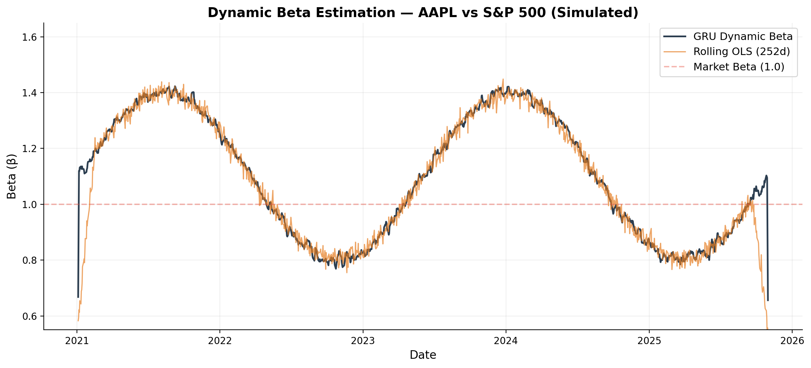

# grubeta — Dynamic Beta Estimation

[](https://www.python.org/downloads/)
[](https://opensource.org/licenses/MIT)
[](https://pypi.org/project/grubeta/)
[](https://grubeta.readthedocs.io)
[](https://doi.org/10.5281/zenodo.20592151)

> Estimate how a stock's market sensitivity (beta) changes over time,
> powered by neural networks with built-in safeguards against lookahead bias.

## What is Dynamic Beta?

In the CAPM framework, **beta (β)** measures how much a stock moves relative to the market:

| Beta | Meaning | Example |
|------|---------|---------|
| β > 1 | Amplifies market moves — higher risk, higher expected return | Growth/tech stocks |
| β = 1 | Moves with the market | Index-tracking ETFs |
| β < 1 | Dampens market moves — lower risk, lower expected return | Utilities, consumer staples |

Traditional beta is estimated as a **single static number** over a historical window. But in reality, beta **changes over time**. A stock's market sensitivity shifts during crises, earnings announcements, sector rotations, and regime changes.

**grubeta** captures these dynamics using a neural network that learns temporal patterns in beta, while ensuring all estimates are free from lookahead bias through walk-forward validation.

## Quick Start

```python
from grubeta import estimate_beta

# Estimate AAPL's time-varying beta relative to S&P 500
result = estimate_beta("AAPL", "SPY")
print(result["summary"])
```

**Output:**
```
AAPL Dynamic Beta Summary (2016-03-19 to 2026-03-19)
─────────────────────────────────────────────────────
  Current Beta:     1.18
  Average Beta:     1.12
  Beta Range:       0.85 → 1.42
  Stability:        0.034 (daily change std)
  Systematic R²:    0.52

  Interpretation: AAPL currently amplifies S&P 500 moves by ~18%.
  A 1% market drop implies a ~1.18% drop in AAPL.
```



## Installation

```bash
pip install grubeta              # core package
pip install grubeta[data]        # + yfinance for ticker symbol support
pip install grubeta[full]        # + technical indicators (RSI, MACD, etc.)
```

## Use Cases

### Portfolio Hedging

```python
from grubeta import estimate_beta

result = estimate_beta("AAPL", "SPY")
current_beta = result["beta"].iloc[-1]

# To hedge $100K in AAPL against market risk:
portfolio_value = 100_000
hedge_amount = current_beta * portfolio_value
print(f"Short ${hedge_amount:,.0f} of SPY to neutralize market exposure")
```

### Comparing Stocks

```python
from grubeta import compare_betas

# Compare tech vs defensive stocks
result = compare_betas(["NVDA", "TSLA", "JNJ", "PG"], market="SPY")
print(result["summary"])
```

### Preset Configurations

Most users don't need to tune parameters — just pick a preset:

```python
# For event studies (captures rapid changes around earnings, crises)
result = estimate_beta("AAPL", "SPY", preset="responsive")

# For long-term portfolio construction (stable, low-noise estimates)
result = estimate_beta("AAPL", "SPY", preset="smooth")

# For academic research (all features, maximum rigor)
result = estimate_beta("AAPL", "SPY", preset="research")
```

| Preset | Best For | Lookback | Retraining |
|--------|----------|----------|------------|
| `default` | General analysis | 3 months (60 days) | Semi-annually (126 days) |
| `responsive` | Event studies, tactical allocation | 6 weeks (30 days) | Monthly (21 days) |
| `smooth` | Strategic portfolio construction | 6 months (120 days) | Annually (252 days) |
| `research` | Academic papers, enhanced model capacity | ~4 months (90 days) | Quarterly (63 days) |

### Command Line

```bash
python -m grubeta AAPL SPY
python -m grubeta AAPL SPY --preset responsive
python -m grubeta AAPL MSFT GOOGL --market SPY --compare
python -m grubeta --list-presets
```

## Examples & Tutorials

| Notebook | Description | Audience |
|----------|-------------|----------|
| [Quickstart](examples/01_quickstart.ipynb) | Estimate beta in 3 lines of code | Everyone |
| [Portfolio Hedging](examples/02_portfolio_hedging.ipynb) | Calculate and apply hedge ratios | Portfolio managers |
| [Comparing Stocks](examples/03_comparing_stocks.ipynb) | Cross-sectional beta analysis | Analysts |
| [Research Workflow](examples/04_research_workflow.ipynb) | Full academic pipeline with diagnostics | Researchers |
| [Complete API Example](examples/complete_example.py) | All API features with synthetic data | Developers |

## Advanced Usage

For users who want fine-grained control, the full API is available:

```python
from grubeta import DynamicBeta, DynamicBetaConfig, DataPreprocessor, FeatureConfig

# Custom feature engineering
config = FeatureConfig(
    include_technicals=True,
    include_macro=True,
    lag_features=True,  # Prevents lookahead bias
)
preprocessor = DataPreprocessor(config)
features = preprocessor.prepare(stock_df, market_df, macro_df)

# Custom model configuration
model = DynamicBeta(config=DynamicBetaConfig(
    lookback=90,
    lambda_beta=0.05,
    lambda_alpha=0.5,
    lambda_alpha_smooth=0.1,
))
results = model.fit_predict(**features)

# Evaluation
from grubeta import BetaEvaluator
evaluator = BetaEvaluator(output_dir='./results')
metrics = evaluator.evaluate(results['beta'], results['stock_return'], results['market_return'])
```

<details>
<summary><strong>All Configuration Parameters</strong></summary>

| Parameter | Default | Description |
|-----------|---------|-------------|
| `lookback` | 90 | How many days of history the model sees at each step |
| `initial_train_size` | 500 | Minimum training samples before first prediction (~2 years) |
| `wf_step_size` | 126 | How often the model retrains (trading days) |
| `batch_size` | 20 | Training batch size |
| `learning_rate` | 1e-4 | Adam optimizer learning rate |
| `gru_units` | 128 | Neural network hidden layer size |
| `dropout_rate` | 0.2 | Regularization strength |
| `lambda_beta` | 0.05 | Beta smoothness — higher = smoother beta |
| `lambda_alpha` | 0.5 | Alpha sparsity — higher = alpha pushed closer to zero |
| `lambda_alpha_smooth` | 0.1 | Alpha smoothness — higher = smoother alpha |
| `epochs_init` | 40 | Training epochs for initial fit |
| `epochs_retrain` | 4 | Training epochs for each retraining step |

</details>

## How It Works

<details>
<summary><strong>Technical Details</strong> (click to expand)</summary>

grubeta uses a **dual-pathway GRU architecture** within the CAPM framework:

```
Market Features ——→ [GRU] ——→ β(t)
                               ↓
                     R_stock = α(t) + β(t) × R_market
                               ↑
Stock Features ——→ [GRU] ——→ α(t)
```

The composite loss function balances four objectives:

```
L = L_accuracy + λ_β × L_stability + λ_α × L_sparsity + λ_α_smooth × L_alpha_stability
```

1. **Accuracy**: Huber loss on return predictions
2. **Beta Stability**: L2 penalty on temporal beta changes
3. **Alpha Sparsity**: L1 penalty on alpha magnitude (CAPM compliance)
4. **Alpha Stability**: L2 penalty on temporal alpha changes

### Lookahead Bias Prevention

grubeta implements strict temporal integrity:
- **Feature lagging**: All inputs delayed by 1+ days
- **Walk-forward validation**: Model only sees historical data at each prediction point
- **Point-in-Time scaling**: Feature normalization uses only past data (expanding window)
- **TemporalCertificate**: Auditable proof of zero lookahead for academic review
- **Built-in diagnostics**: `validate_no_lookahead()` verifies temporal correctness

### Comparison with Other Methods

| Method | Time-Varying | Non-linear | Lookahead Free | Walk-Forward |
|--------|:---:|:---:|:---:|:---:|
| Static OLS | | | ✓ | N/A |
| Rolling OLS | ✓ | | ✓ | ✓ |
| EWMA | ✓ | | ✓ | ✓ |
| Kalman Filter | ✓ | | ✓ | ✓ |
| DCC-GARCH | ✓ | Partial | ✓ | ✓ |
| **grubeta** | **✓** | **✓** | **✓** | **✓** |

</details>

## For Researchers

- **Temporal integrity**: All estimates guaranteed lookahead-free via walk-forward validation and point-in-time scaling
- **Reproducibility**: `TemporalCertificate` provides auditable methodology proof
- **Benchmarks**: Built-in comparison with rolling OLS, EWMA, and static beta
- **Diagnostics**: Lookahead bias tests, ADF stationarity tests, Ljung-Box autocorrelation tests

Full API documentation: [grubeta.readthedocs.io](https://grubeta.readthedocs.io)

## Citation

```bibtex
@software{grubeta2026,
  author = {Yılmaz, Ahmet Selim},
  title = {grubeta: GRU-based Dynamic Beta Estimation for Time-Varying Systematic Risk},
  year = {2026},
  url = {https://github.com/aslmylmz/grubeta}
}
```

## Contributing

Contributions welcome! See [CONTRIBUTING.md](CONTRIBUTING.md) for guidelines.

## License

MIT License — see [LICENSE](LICENSE) for details.

## Changelog

See [CHANGELOG.md](CHANGELOG.md) for version history.
